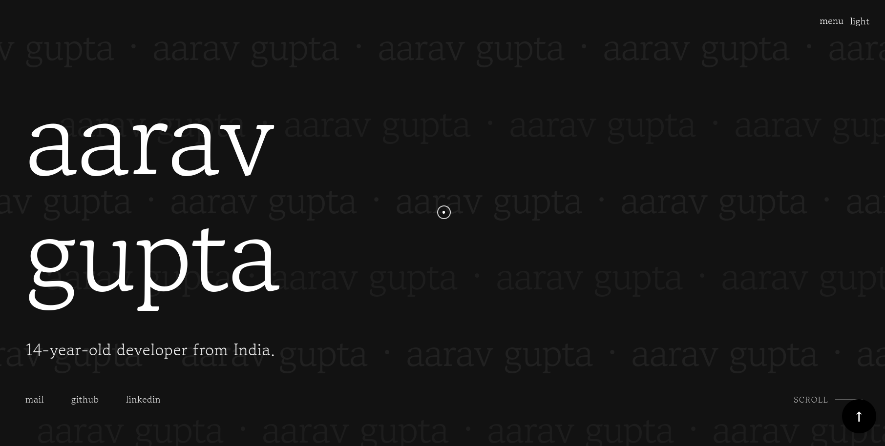

<h1 align="center">AarusPortfolio</h1>

  A personal portfolio website showcasing my projects, skills, and experiences.  
  Built with modern web technologies including HTML5, CSS3, JavaScript, and GSAP animations.

  

---

## Table of Contents

- [Features](#features)
- [Technologies](#technologies)
- [Contributing](#contributing)
- [License](#license)

---

## Notable Achievements

- Website officially certified by Google  
- Featured in [Github's Most Famous Portfolio Repository](https://github.com/emmabostian/developer-portfolios)

## Features

- Responsive design optimized for all devices  
- Smooth animations using GSAP  
- Dark/Light mode toggle  
- Custom cursor animations  
- Minimalist preloader  
- Smooth scrolling  
- Contact form integration  
- SEO optimized  

---

## Technologies

- HTML5  
- CSS3 (Custom Properties, Grid, Flexbox)  
- JavaScript (ES6+)  
- GSAP (GreenSock Animation Platform)  
- EmailJS for contact form  
- Google Analytics  

---

## Contributing

1. Fork the project  
2. Create your feature branch (`git checkout -b feature/amazing-feature`)  
3. Commit your changes (`git commit -m 'Add some amazing feature'`)  
4. Push to the branch (`git push origin feature/amazing-feature`)  
5. Open a Pull Request  

---

## License

Distributed under the MIT License. See `LICENSE` for more information.

---

## Contact

**Aarav Gupta** – [tribejustice35@gmail.com](mailto:tribejustice35@gmail.com)  
