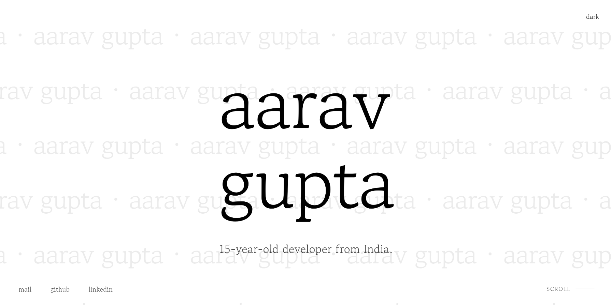

<h1 align="center">🌐 AarusPortfolio</h1>

<p align="center">
  A personal portfolio website showcasing my projects, skills, and experiences.  
  Built with modern web technologies including HTML5, CSS3, JavaScript, and GSAP animations.
</p>

<p align="center">
  
</p>

---

## 📑 Table of Contents

- [⚙️ Installation](#installation)
- [✨ Features](#features)
- [🛠️ Technologies](#technologies)
- [🤝 Contributing](#contributing)
- [📜 License](#license)

---

## 🏆 Notable Achievements

- ✅ Website officially certified by Google  
- 🌟 Featured in [Github's Most Famous Portfolio Repository](https://github.com/emmabostian/developer-portfolios)

---

## ⚙️ Installation

```bash
# Clone the repository
git clone https://github.com/Aarav2709/AarusPortfolio.git

# Navigate to the project directory
cd AarusPortfolio

# Open index.html in your browser or use a local server
```

---

## ✨ Features

- 📱 Responsive design optimized for all devices  
- 🎬 Smooth animations using GSAP  
- 🌙 Dark/Light mode toggle  
- 🖱️ Custom cursor animations  
- ⏳ Minimalist preloader  
- 📜 Smooth scrolling  
- 📩 Contact form integration  
- 🔍 SEO optimized  

---

## 🛠️ Technologies

- HTML5  
- CSS3 (Custom Properties, Grid, Flexbox)  
- JavaScript (ES6+)  
- GSAP (GreenSock Animation Platform)  
- EmailJS for contact form  
- Google Analytics  

---

## 🤝 Contributing

1. Fork the project  
2. Create your feature branch (`git checkout -b feature/amazing-feature`)  
3. Commit your changes (`git commit -m 'Add some amazing feature'`)  
4. Push to the branch (`git push origin feature/amazing-feature`)  
5. Open a Pull Request  

---

## 📜 License

Distributed under the MIT License. See `LICENSE` for more information.

---

## 📬 Contact

**Aarav Gupta** – tribejustice35@gmail.com  

Project Link: [https://github.com/Aarav2709/AarusPortfolio](https://github.com/Aarav2709/AarusPortfolio)
